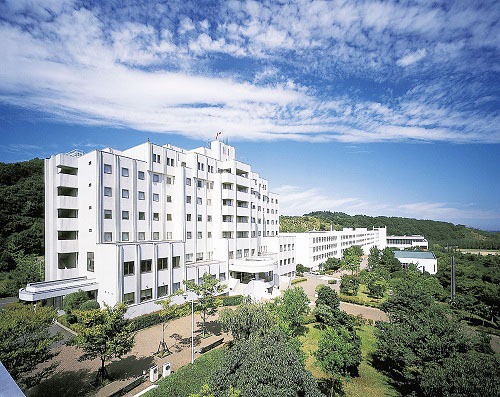

# 情報工学科の紹介
<!-- Markdown記法を使って学科の紹介ページを作る -->
1. ## キャンパスの場所

    情報工学科は八王子国際キャンパスにあります:sparkles:
    
    [拓殖大学](http://www.takushoku-u.ac.jp "Takushoku University")

1. ## 情報工学科のコース
    2学年で情報工学科の学生はコースを選らんでより専門的な分野を学ぶことができます:+1:

- #### *システムエンジニアリング*

    プログラミングを基礎から学び、自在にコンピュータを制御するソフトウェアや情報システムの設計技術を修得していきます。モバイルシステムのような身近なものから“富岳”のようなスーパーコンピュータを使う大規模かつ高度なものまで、時代に必要とされる情報システムを創造するエンジニアを育成します。
- #### *インターネット&セキュリティ*
    昨今の情報化社会は、私たちの暮らしをとても豊かなものにしてきましたが、その一方で、これまでにはみられなかった様々な脅威が発生しています。それらから私たちの暮らしを守り、安全で安心できる情報社会を構築するために、ネットワーク技術や情報セキュリティ対策などについて学びます。
- #### *知能情報*　
    あらゆるモノがネットワークに繋がるIoT、さまざまなコトに繋げるビッグデータ解析や人工知能は、既に私たち人間にとって日常の一部になっています。これらの知識・技術を基礎から応用まで学び、目覚しく変化する情報社会の新しい今後を創り出す専門家の育成を目指します。
###学生男女比
|男子|女子|
|:---|---:|
| 327人| 29人 |
| 91.9% | 8.1%|　
　
> 引用 https://feng.takushoku-u.ac.jp/composition/cs.html#anchor01
<!-- この部分より上に記述を追加して下のチェックボックスで確認する -->
- [x] 2種類以上の見出し(headers)を使っている．
- [x] 2種類以上の強調(emphasis)を使っている．
- [x] (番号付きの)リスト(ordered lists)を使っている
- [x] (番号無しの)リスト(unordered lists)を使っている．
- [x] 1つ以上の画像(images)を使っている．
- [x] 1つ以上のリンク(links)を使っている．
- [x] 1つ以上の表(tables)を使っている．
- [x] 1つ以上の絵文字を使っている．